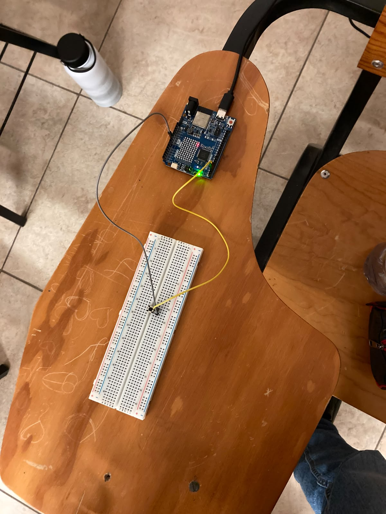
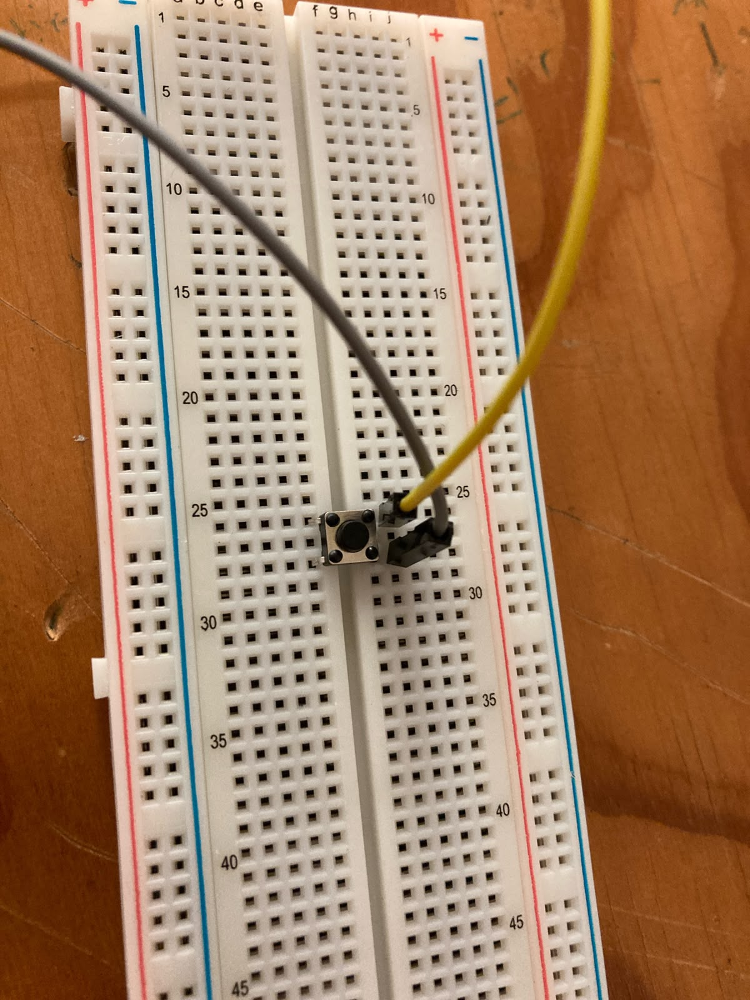
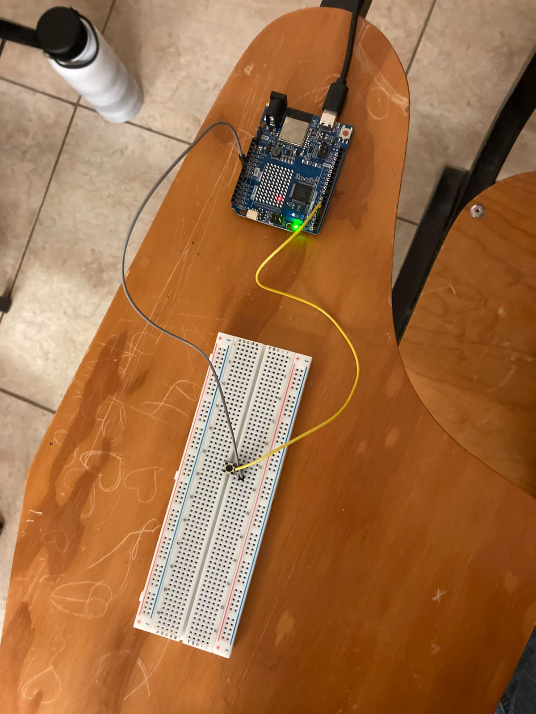
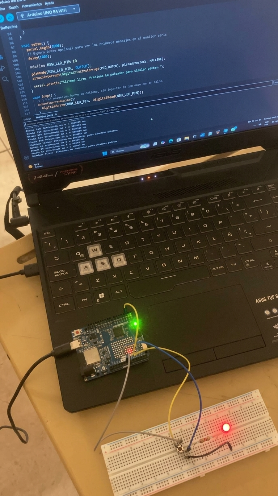
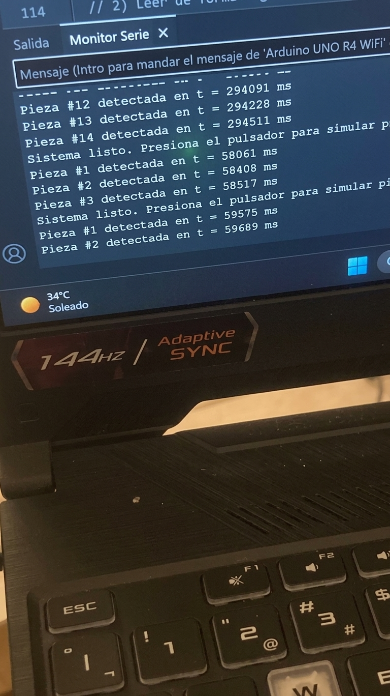

# Interrupciones Externas y Buffers Circulares

## Descripción
Esta práctica implementa un sistema de detección de eventos asíncronos en Arduino UNO R4 WiFi 
usando interrupciones externas y un buffer circular (ring buffer). Un pulsador simula el sensor 
de una banda transportadora industrial que detecta piezas en cualquier momento, mientras el 
sistema realiza simultáneamente una animación en la matriz de LEDs integrada.

## Objetivos

* Configurar y usar una interrupción externa para detectar eventos asíncronos.
* Implementar un buffer circular para desacoplar la detección del procesamiento.
* Aplicar un filtro de rebote (debounce) dentro de la ISR.
* Demostrar que dos tareas pueden coexistir sin bloquearse mutuamente.

## Herramientas y material utilizado

* Arduino UNO R4 WiFi.
* Arduino IDE.
* Pulsador táctil.
* Resistencia de 10 kΩ (pull-down).
* Protoboard.
* Cables de conexión (jumpers).

## Diagrama
El diagrama muestra las conexiones utilizadas para implementar el sistema de interrupciones 
con buffer circular.

### Evidencia del circuito físico

## Código
El programa configura una interrupción externa en el pin del pulsador. Al detectar una 
pulsación, la ISR anota el evento en el buffer circular y regresa de inmediato. El loop() 
lee los eventos pendientes del buffer y los muestra en el Monitor Serial, mientras ejecuta 
la animación de la matriz de LEDs de forma continua.

[Ver código](https://github.com/Benja-S-V/Universidad/blob/main/PracticaInterrupciones/Codigo)

## Reporte
El reporte contiene la explicación del funcionamiento del sistema, la metodología utilizada, 
el análisis de los resultados y las conclusiones obtenidas durante la práctica.

[Ver Reporte](https://github.com/Benja-S-V/Universidad/blob/main/PracticaInterrupciones/Reporte)

## Resultados
Durante las pruebas, el sistema detectó y registró correctamente el 100% de las pulsaciones, 
incluso al presionar el botón de forma rápida y consecutiva con intervalos menores a 150 ms. 
El filtro de rebote implementado dentro de la ISR evitó registros duplicados en todas las pruebas.

La animación en la matriz de LEDs se ejecutó de forma continua y sin pausas perceptibles 
durante toda la sesión, confirmando que las dos tareas coexistieron sin bloquearse mutuamente. 
El Monitor Serial mostró el conteo acumulado de piezas detectadas con su timestamp correspondiente 
en milisegundos.

[Ver carpeta Resultados](https://github.com/Benja-S-V/Universidad/blob/main/PracticaInterrupciones/Resultados)

## Video
El video muestra el funcionamiento del sistema de interrupciones, incluyendo la detección 
de pulsaciones y la animación continua en la matriz de LEDs del Arduino.

[Ver video](https://youtu.be/683_3GgW0cs)

[Ver carpeta Video](https://github.com/Benja-S-V/Universidad/blob/main/PracticaInterrupciones/Video)

## Conclusiones
La práctica permitió comprender el funcionamiento de las interrupciones externas como mecanismo 
de detección inmediata de eventos asíncronos, sin necesidad de revisar constantemente el estado 
del pin mediante polling.

El buffer circular demostró ser una estructura eficiente para desacoplar la detección del 
procesamiento, permitiendo que la ISR escriba eventos a cualquier momento y que el loop() 
los lea a su propio ritmo sin pérdidas ni bloqueos mutuos.

En conjunto, la práctica permitió aplicar un patrón de diseño utilizado en sistemas embebidos 
reales, comprobando su funcionamiento mediante el circuito armado y las pruebas realizadas.
