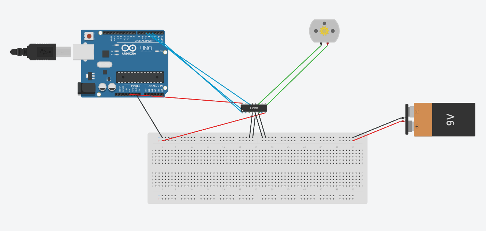
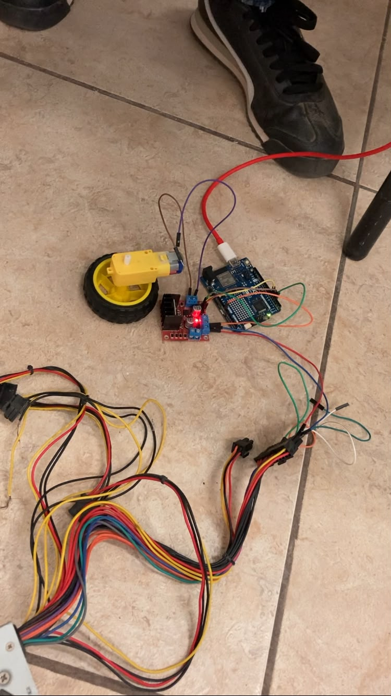
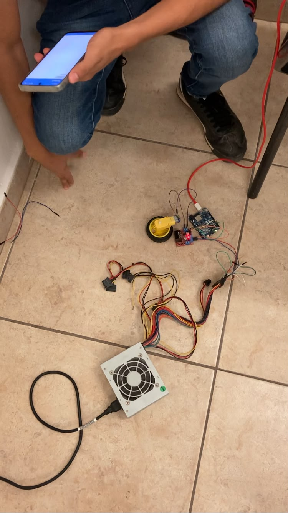
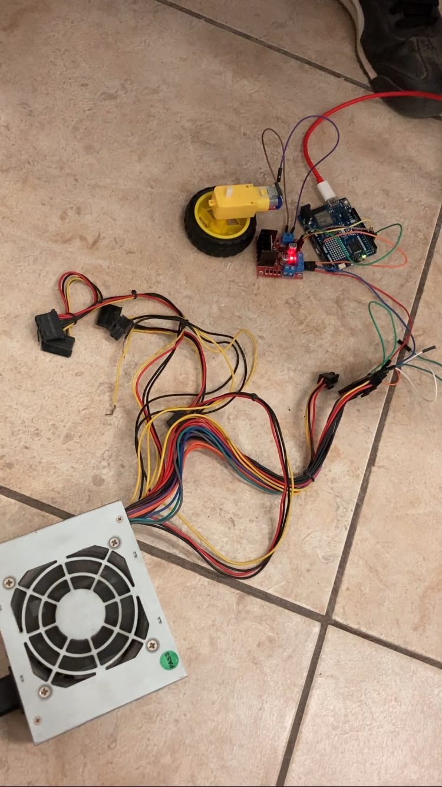

# Control de Motor de Rueda con Driver L293D y Arduino UNO R4 WiFi

## Descripción
Esta práctica implementa el control bidireccional y de velocidad de un motor de corriente continua (CC) 
utilizando el driver L293D (Puente H) y una tarjeta Arduino UNO R4 WiFi. La interacción con el sistema 
se realiza en tiempo real procesando comandos de texto enviados desde el Monitor Serie.

El circuito incluye una etapa de potencia aislada mediante una fuente regulada externa de 12V para 
garantizar el torque óptimo del motor sin comprometer la estabilidad lógica del microcontrolador.

## Objetivos

* Implementar el control bidireccional de un motor CC mediante el driver L293D.
* Controlar la velocidad del motor utilizando señales PWM.
* Establecer comunicación serie para recibir comandos en tiempo real.
* Aislar la etapa de potencia de la etapa lógica mediante fuente externa.
* Comprender el funcionamiento del Puente H para el control de motores CC.

## Herramientas y material utilizado

* Arduino UNO R4 WiFi.
* Arduino IDE.
* Driver L293D (Puente H).
* Motor de corriente continua (CC) 12V.
* Fuente regulada externa 12V.
* Protoboard.
* Resistencias limitadoras de corriente.
* Cables de conexión (jumpers).

## Diagrama
El diagrama muestra las conexiones utilizadas para implementar el control del motor con el driver L293D.

### Evidencia del circuito físico

## Código
El programa implementa el control bidireccional y PWM del motor CC, recibiendo comandos 
por el Monitor Serie para cambiar el sentido y la velocidad de giro en tiempo real.

[Ver código](https://github.com/Benja-S-V/Universidad/blob/main/PracticaMotorR/Codigo)

## Reporte
El reporte contiene la explicación del funcionamiento del sistema, la metodología utilizada, 
el análisis de los resultados y las conclusiones obtenidas durante la práctica.

[Ver Reporte](https://github.com/Benja-S-V/Universidad/blob/main/PracticaMotorR/Reporte/Reporte_Practica_Control_MotorRueda_L293D.pdf)

## Resultados
Durante las pruebas, el motor presentó el comportamiento esperado respondiendo correctamente 
a los comandos enviados por el Monitor Serie. El control de velocidad mediante PWM permitió 
variar las RPM del motor de forma progresiva, mientras que el cambio de sentido se realizó 
de manera inmediata al recibir el comando correspondiente.

Se verificó el correcto aislamiento entre la etapa de potencia y la etapa lógica, 
comprobando que las fluctuaciones de voltaje del motor no afectaron el funcionamiento 
del microcontrolador durante las pruebas.

[Ver carpeta Resultados](https://github.com/Benja-S-V/Universidad/blob/main/PracticaMotorR/Resultados)

## Video
El video muestra el funcionamiento del motor CC con el control bidireccional y de velocidad, 
incluyendo la respuesta del sistema ante los comandos enviados por el Monitor Serie.

[Ver video](https://youtube.com/shorts/whfj_7Ri47Q?feature=share)

[Ver carpeta Video](https://github.com/Benja-S-V/Universidad/blob/main/PracticaMotorR/Video)

## Conclusiones
La práctica permitió comprender el funcionamiento del driver L293D como Puente H para el 
control bidireccional de motores CC, aplicando señales PWM para el manejo de velocidad.

El uso del Monitor Serie como interfaz de control demostró ser una solución eficiente para 
interactuar con el sistema en tiempo real. El aislamiento de la etapa de potencia mediante 
fuente externa resultó fundamental para garantizar la estabilidad del microcontrolador 
durante el funcionamiento del motor.

En conjunto, la práctica permitió relacionar los conceptos de electrónica de potencia con 
la programación en Arduino, comprobando su funcionamiento mediante el circuito armado y 
las pruebas realizadas.
