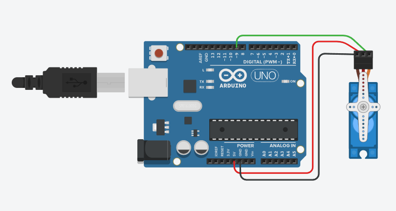
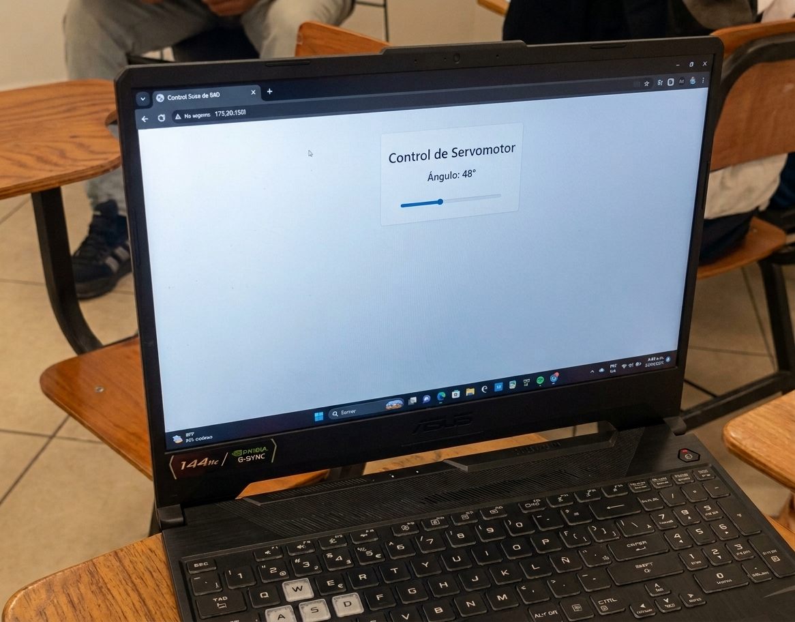
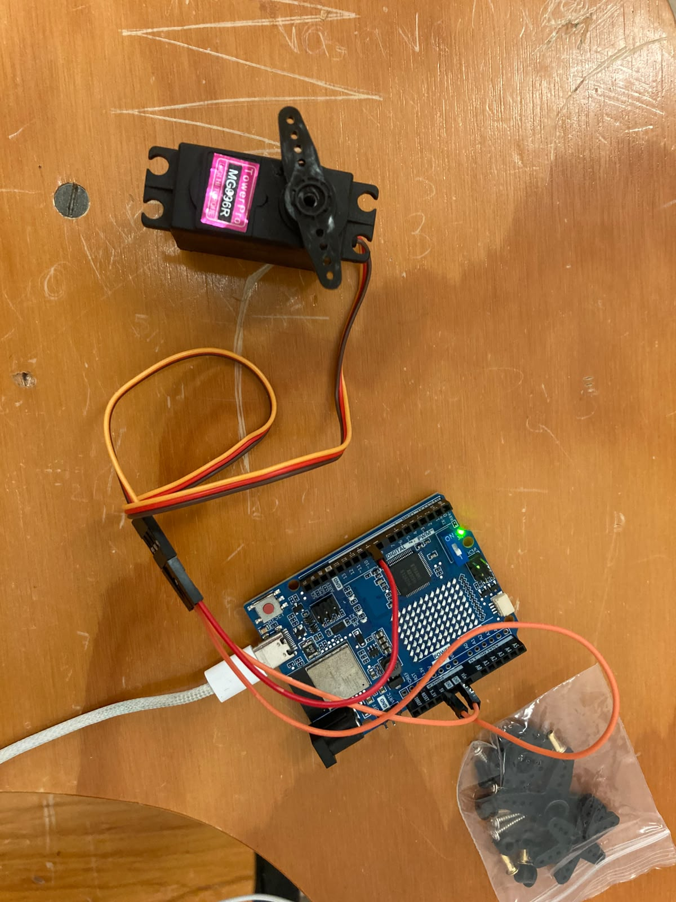

# Control de Servomotor con Arduino UNO R4 WiFi

## Descripción
Esta práctica implementa el control de posición de un servomotor mediante una interfaz 
web alojada en el propio Arduino UNO R4 WiFi, aprovechando su módulo WiFi integrado.

El sistema permite controlar los grados del servomotor en tiempo real desde cualquier 
dispositivo conectado a la misma red, enviando comandos a través del navegador web 
sin necesidad de instalar aplicaciones adicionales.

## Objetivos

* Implementar el control de posición de un servomotor mediante señales PWM.
* Configurar el módulo WiFi del Arduino UNO R4 WiFi para alojar una interfaz web.
* Controlar los grados del servomotor en tiempo real desde un navegador web.
* Comprender el funcionamiento de un servomotor y su rango de movimiento.
* Establecer comunicación entre el microcontrolador y dispositivos externos vía WiFi.

## Herramientas y material utilizado

* Arduino UNO R4 WiFi.
* Arduino IDE.
* Servomotor.
* Protoboard.
* Cables de conexión (jumpers).
* Dispositivo con navegador web (para la interfaz de control).

## Diagrama
El diagrama muestra las conexiones utilizadas para implementar el control del servomotor.

### Evidencia del circuito físico

## Código
El programa configura el módulo WiFi del Arduino para alojar una interfaz web que permite 
controlar la posición del servomotor en tiempo real enviando los grados deseados desde 
el navegador.

[Ver código](https://github.com/Benja-S-V/Universidad/blob/main/PracticaServoM/Codigo)

## Reporte
El reporte contiene la explicación del funcionamiento del sistema, la metodología utilizada, 
el análisis de los resultados y las conclusiones obtenidas durante la práctica.

[Ver Reporte](https://github.com/Benja-S-V/Universidad/blob/main/PracticaServoM/Reporte/Reporte_Control_Servomotor.pdf)

## Resultados
Durante las pruebas, el servomotor respondió correctamente a los comandos enviados desde 
la interfaz web, posicionándose en el ángulo indicado de forma precisa y en tiempo real.

La interfaz web fue accesible desde distintos dispositivos conectados a la misma red, 
confirmando el correcto funcionamiento del módulo WiFi integrado del Arduino UNO R4 WiFi. 
El servomotor se desplazó dentro de su rango de 0° a 180° sin presentar fallos ni 
comportamientos inesperados durante las pruebas realizadas.

[Ver carpeta Resultados](https://github.com/Benja-S-V/Universidad/blob/main/PracticaServoM/Resultados)

## Video
El video muestra el funcionamiento del servomotor siendo controlado en tiempo real 
desde la interfaz web, incluyendo el desplazamiento del eje en diferentes posiciones.

[Ver video](https://youtube.com/shorts/sbbOrjJNTes?feature=share)

[Ver carpeta Video](https://github.com/Benja-S-V/Universidad/blob/main/PracticaServoM/Video)

## Conclusiones
La práctica permitió comprender el funcionamiento de un servomotor y su control mediante 
señales PWM, integrando además las capacidades de conectividad WiFi del Arduino UNO R4 WiFi 
para construir una interfaz de control remoto accesible desde el navegador.

La combinación del control físico del servomotor con la interfaz web demostró ser una 
solución práctica y escalable para el control remoto de actuadores, aplicable en proyectos 
de automatización e IoT.

En conjunto, la práctica permitió relacionar conceptos de electrónica, programación y 
comunicación inalámbrica, comprobando su funcionamiento mediante el circuito armado 
y las pruebas realizadas.
