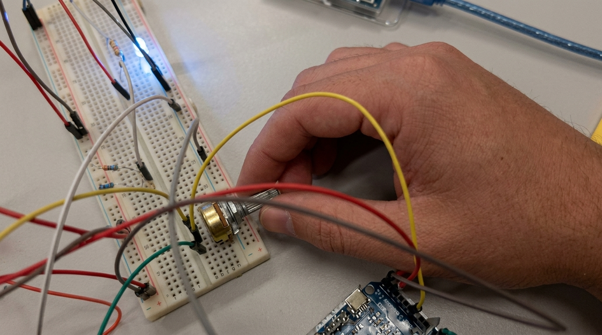
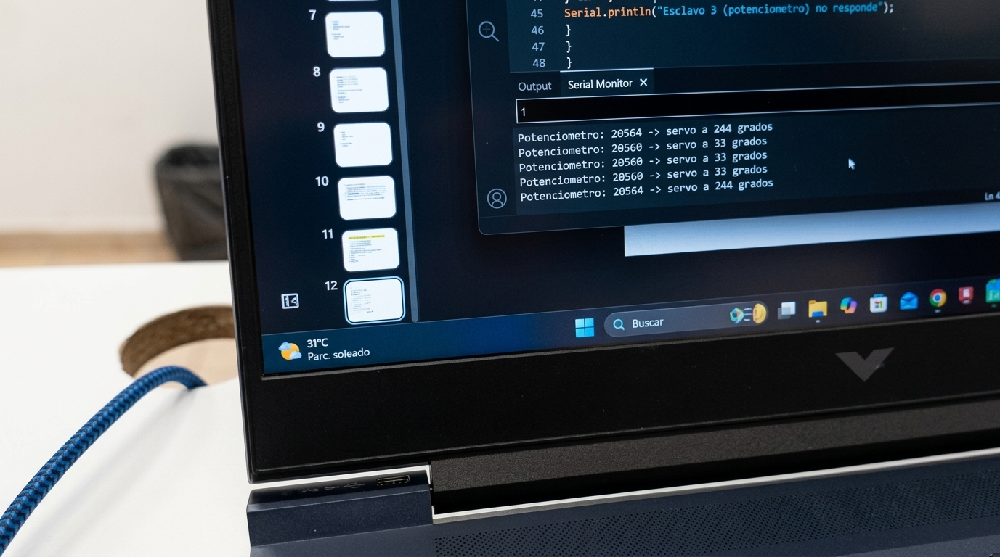
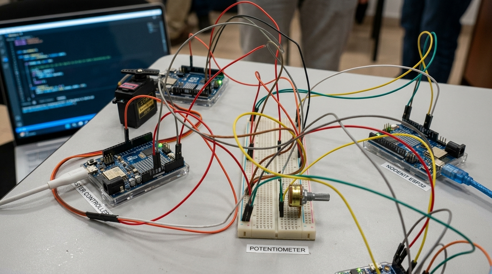

# Comunicación I2C entre 4 Arduinos

## Descripción
Esta práctica implementa un bus I2C con cuatro Arduino UNO R4 WiFi. Un Arduino maestro 
se comunica con tres esclavos a través de las líneas SDA (A4) y SCL (A5) con tierra 
común entre todos.

- Esclavo 1 (0x08): recibe una orden del maestro y enciende o apaga un LED.
- Esclavo 2 (0x09): recibe un ángulo del maestro y mueve un servomotor.
- Esclavo 3 (0x0A): lee un potenciómetro y envía su valor al maestro cuando este lo pide.

Al girar el potenciómetro, el Esclavo 3 envía el valor al maestro. El maestro lo convierte 
a grados (0°–180°) y se los manda al Esclavo 2, que mueve el servo en tiempo real. 
El maestro imprime en el Monitor Serie los grados actuales del servo cada 500 ms, 
permitiendo ver en microsegundos cómo responde el servo al movimiento del potenciómetro.

## Objetivos de aprendizaje
Comprender el funcionamiento del bus I2C mediante la comunicación entre un Arduino maestro
y tres Arduinos esclavos, que comparten las líneas SDA y SCL y se identifican con direcciones
distintas (0x08, 0x09 y 0x0A).

## Material utilizado
- 4 Arduino UNO R4 WiFi
- 1 protoboard
- 1 LED
- 1 resistencia de 470 Ω
- 1 micro servo
- 1 potenciómetro
- 2 resistencias de 4.7 kΩ (pull-up en SDA y SCL)
- Cables de conexión

## Diagrama del circuito

## Código
[maestro.ino](Codigo/maestro.ino)

[esclavo1_led.ino](Codigo/esclavo1_led.ino)

[esclavo2_servo.ino](Codigo/esclavo2_servo.ino)

[esclavo3_potenciometro.ino](Codigo/esclavo3_potenciometro.ino)

## Video del funcionamiento

[Ver video](https://youtu.be/2nInlPzRGwA)

## Evidencias de armado

## Reporte
[Ver Reporte](Reporte/Reporte_Protocolo12C.pdf)

## Resultados
[Ver Resultados](Resultados/Resultados_Protocolo12C.pdf)

## Conclusiones
El bus I2C permite comunicar varios dispositivos usando solo dos líneas (SDA y SCL) más
tierra común. Cada esclavo debe tener una dirección única; si dos comparten la misma,
los datos se corrompen. El maestro controla toda la comunicación y se usó millis() en
lugar de delay() para que no se bloquee al atender el Monitor Serie y consultar el
potenciómetro al mismo tiempo.
